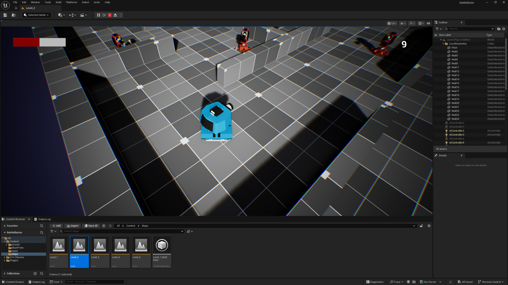
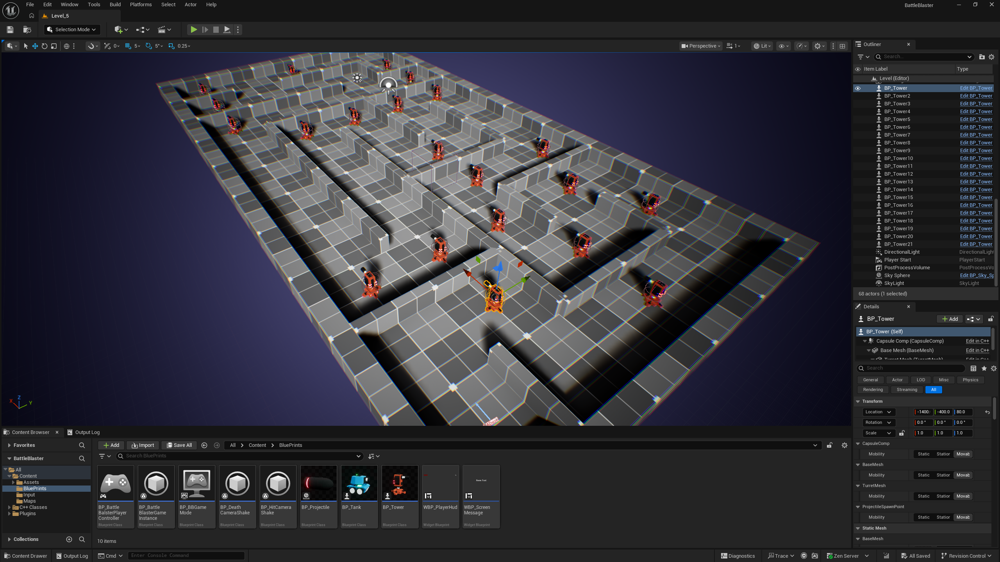
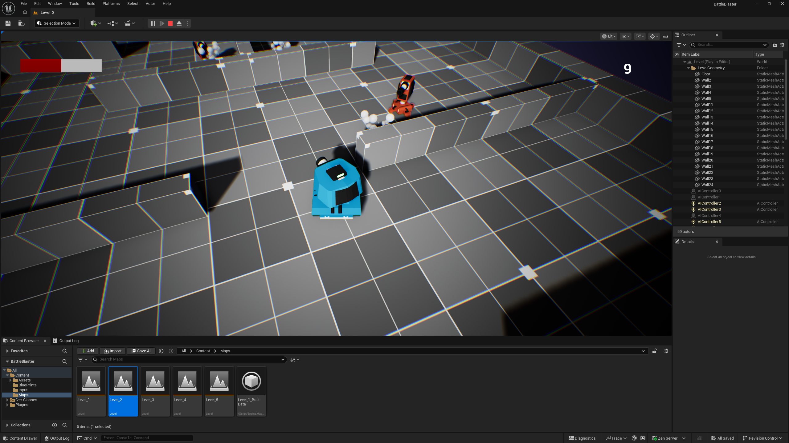

# BattleBlaster

BattleBlaster is an educational tank-combat game developed with Unreal Engine
5.8 and C++. I completed its foundation while following the GameDev.tv Unreal
C++ course, then expanded it with my own gameplay and level-design work.

## My Additions

- Player health bar using an Unreal UMG progress bar
- Remaining-enemy counter that updates during gameplay
- Five personally designed levels
- Multi-level progression and game restart behavior
- Friendly-fire prevention so enemy towers cannot destroy one another
- Linux migration and UE 5.8 build compatibility

## What I Learned

This project gave me practical experience writing Unreal C++ classes and
connecting them with Blueprints and UMG widgets. I worked with actors,
components, game modes, damage handling, timers, level transitions, input,
projectiles, and runtime UI updates.

I also gained experience diagnosing gameplay bugs, extending tutorial code,
building Unreal projects on Linux, and managing changes through Git branches
and pull requests.

## Gameplay Video

A gameplay video recorded with OBS Studio will be added here.

## Technology

- Unreal Engine 5.8
- C++
- Unreal Motion Graphics (UMG)
- Enhanced Input
- Niagara
- Rider on Linux

## Repository Scope

This is a learning and source-code portfolio. Course-provided and third-party
source assets are intentionally excluded from the repository, so it is not a
complete clone-and-run distribution.

## Attribution

The project foundation follows the
[GameDev.tv Unreal Engine 5 C++ Game Development course](https://www.udemy.com/course/unrealcourse/),
taught by Kaan Alpar.

The tutorial foundation is not presented as independently designed work. My
original additions are listed above. See [ATTRIBUTION.md](ATTRIBUTION.md) and
[LICENSE](LICENSE) for further details.

## Future Goals

I am continuing to study C++ and Unreal Engine with the goal of becoming a game
developer. Future projects will focus on creating increasingly original game
mechanics, systems, and complete playable experiences.